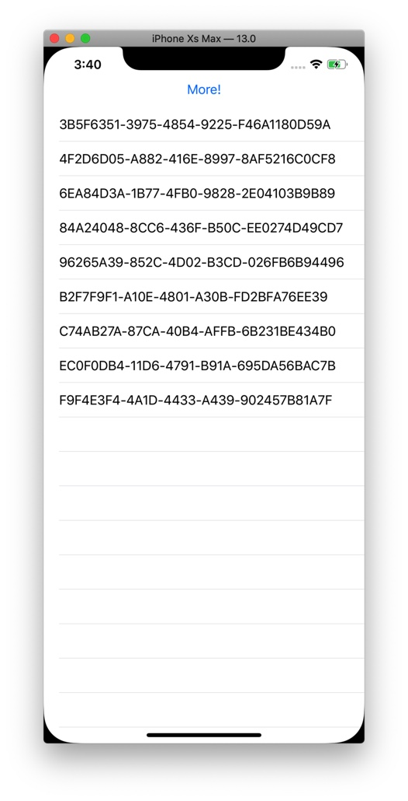

# Core Data Test!

This app shows how to use the new-fangled features in SwiftUI.

In `ContentView.swift` you'll see how to drive a list from a live fetch request using the new `@FetchRequest` property wrapper. If you run the app and tap the button at the top, it will add a new random entity which will live-update the SwiftUI `List`.

From my fiddlding, I found that SwiftUI uses a `NSFetchResultsController` under the hood which means the fetch request you use must have a sort descriptor.

You'll also notice in `SceneDelegate.swift` that you need to configure the `NSManagedObjectContext` that is included in SwiftUI's `Environment`. This is how you connect your persistent store coordinator to your SwiftUI views.

